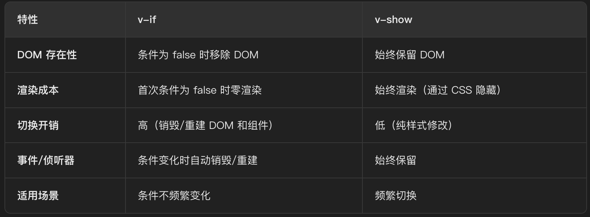

# 一、Vue2

### 1. 关于生命周期

##### 	1.1 生命周期有哪些？发送请求在created还是mounted？

```
请求接口测试：https://fcm.52kfw.cn/index.php?_mall_id=1&r=api/default/district
```

Vue2.x系统自带有8个

```
beforeCreate
created
beforeMount
mounted
beforeUpdate
updated
beforeDestroy
destroyed
```

发送请求在created还是mounted？

```
这个问题具体要看项目和业务的情况了，因为组件的加载顺序是，父组件引入了子组件，那么先执行父的前3个生命周期，再执行子的前4个生命周期，那么如果我们的业务是父组件引入子组件，并且优先加载子组件的数据，那么在父组件中当前的请求要放mounted中，如果当前组件没有依赖关系那么放在哪个生命周期中请求都是可以的。
```

##### 	1.2 为什么发送请求不在beforeCreate里？beforeCreate和created有什么区别？

为什么发送请求不在beforeCreate里？

```
因为：如果请求是在methods封装好了，在beforeCreate调用的时候，beforeCreate阶段是拿不到methods里面的方法的（会报错了）。
```

beforeCreate和created有什么区别？

```
beforeCreate没有$data
created中有$data

created是可以拿到methods的方法的
beforeCreate拿不到methods的方法
```

##### 	1.3 在created中如何获取dom

```
1. 只要写异步代码，获取dom是在异步中获取的，就可以了。
	例如：setTimeout、请求、Promise.xxx()等等...
	（其实就是将获取dom的操作放入异步队列，而异步队列就是在monuted中进行）
2. 使用vue系统内置的this.$nextTick
```

##### 	1.4 一旦进入组件会执行哪些生命周期？

```
beforeCreate
created
beforeMount
mounted
```

##### 	1.5 第二次或者第N次进去组件会执行哪些生命周期？

```
keep-alive包裹的组件
activated
deactivated(停用瞬间进入)

普通组件
beforeCreate
created
beforeMount
mounted
```

##### 	1.6 父组件引入子组件，那么生命周期执行的顺序是？

```
父：beforeCreate、created、beforeMount
子：beforeCreate、created、beforeMount、mounted
...
父：mounted

先结束父级的前三个生命周期，随后结束子组件的四个生命周期，最后结束父级的monted
```

##### 	1.7 加入keep-alive会执行哪些生命周期？

```
首次进入组件：
beforeCreate，created，beforeMount，mounted，activated

第n次进入组件（n >= 2）：
activated（进入组件时触发），deactivated（离开组件时触发）
```

##### 1.8 你在什么情况下用过哪些生命周期？说一说生命周期使用场景

```
created：向服务器发送请求获取数据

mounted：（activated）
1.当需要先渲染页面时，发请求获取数据
2.绑定事件监听
3.echarts第三方插件初始化

beforeDestroy：（deactivated）卸载组件前
1.清空仓库数据
2.清除定时器
```


### 2. 关于组件

##### 	2.1 组件传值（通信）的方式

###### 	（父=>子&父=>后代）

```
1.父传子
  父组件中绑定数据
  <el-table :data="data">...</el-table>
  子组件中用props接收
  props:{
  	data:{
  		type:'Array',
  		...
  	}
  }
  特点：子组件不可修改父组件数据，父组件给孙子等第三、四...代传递数据时需要逐层传递，十分麻烦
  
2.父传子 子可修改父（修改数据流向，不推荐使用）
  this.$parent.xxx 使用父组件数据
  
3.依赖注入 provide & inject
```

（后代传父）

```
1.子组件传值给父组件
	this.$emit 触发自定义事件
2.父组件直接修改子组件数据
	<List ref='child'></List>
	this.$refs.child
```

（同级传数据）

```
事件总线bus
```

##### 	2.2 父组件直接修改子组件的值

```
vue2:
<List ref='child'></List>
this.$refs.child.xxx = 'yyyy';

vue3:
<Child ref='childRef'></Child>
const childRef = ref(null);
childRef.value.xxx(.value)
```

##### 	2.3 子组件直接修改父组件的值

```
this.$parent.xxx
```

##### 	2.4 如何找到父组件

```
this.$parent
```

##### 	2.5 如何找到根组件

```
this.$root
```

##### 	2.6 keep-alive

```
缓存当前组件
```

##### 	2.7 slot

```
匿名插槽：没有名字
具名插槽：有名字
作用于插槽：传值
```

##### 	2.8 如何封装组件

```

```


### 3. 关于Vuex

##### 	3.1 Vuex有哪些属性

```
State      =====>   全局共享属性(单一数据源)
Getter     =====>   针对 state 中的属性二次计算
Mutation   =====>   存放同步方法
Action     =====>   存放异步方法
Module     =====>   将 vuex 模块化
```

##### 	3.2 Vuex使用state值

```
this.$store.state.xxx  可以直接修改数据
辅助函数：mapState       不可修改数据
```

##### 	3.3 Vuex的getters值修改

```
不可修改
```

问：组件使用了getters中的内容，组件使用采用v-model的形式会发生什么？

```
假设在input框中使用了v-model绑定getters中的内容，在页面上直接修改input框中的内容会发生报错，因为v-model双向绑定，修改input框内容相当于修改getters内容，而getters内容不可被修改
```

##### 	3.4 Vuex的mutations和actions

```
相同点：都用来存放全局方法，不可以用来return数据

不同点：mutations 完成同步操作
	    actions 完成异步操作 返回promise

mutations直接修改state中的数据，actions一般用来完成异步操作，在异步操作中通过commit调用触发mutations中的方法
```

##### 	3.5 Vuex持久化存储

```
1. localStorage
2. vuex-persistedstate 插件
```


### 4. 关于路由

##### 	4.1 路由的模式和区别

```
hash & history
```

```
区别：
①当找不到当前路由对应页面时：
	hash: 不操作
	history: 向后端发送一次请求
②项目打包前端自测：（pnpm run build）
	hash：可以看到内容
	history：默认情况下内容不可见
③表象不同（在浏览器地址栏显示的地址）：
	hash：带#
	history：/
```

##### 	4.2 子路由和动态路由

```
项目中
```

##### 	4.3 路由传值

```
router.push({ name: '...', params: {...} })
const { ... } = route.params; // 接收并解构
```

##### 	4.4 导航故障

```
可能出现导航故障的情况：
https://router.vuejs.org/zh/guide/advanced/navigation-failures.html#%E6%A3%80%E6%B5%8B%E5%AF%BC%E8%88%AA%E6%95%85%E9%9A%9C

解决方法：
import VueRouter from 'vue-router'
const routerPush = VueRouter.prototype.push
VueRouter.prototype.push = function(location) {
	return routerPush.call(this, location).catch(error => error)
}
```

##### 	4.5 $router和$route区别

```
$router 不仅包含当前路由还包含整个路由的属性和方法
 
$route 包含当前路由对象
```

##### 	4.6 导航守卫

```
1.全局路由守卫
	beforeEach 路由进入之前
	afterEach  路由进入之后
	
2.路由独享守卫
  beforeEnter 路由进入之前
  
3.组件内守卫
	beforeRouteEnter  路由进入之前
	beforeRouteUpdate 路由更新之前
	beforeRouteLeave  路由离开之前
```

### 5. 关于API

##### 	5.1 $set（vue2）

```
有没有遇见过数据更新，试图没更新的问题，怎么解决
```

```
向响应式对象中添加一个 property，并确保这个新 property 同样是响应式的，且触发视图更新
this.$set(target, propertyName/index, value)
target: 目标对象/数组
propertyName/index: 对象属性名/数组索引
value: 要 set 的目标值
```

##### 	5.2 $nextTick（2+3）

```
功能：获取更新后的dom

vue2:
	利用浏览器的 事件循环机制（Event Loop），优先使用 微任务（Promise.then、MutationObserver），若不支持则降级为 宏任务（setTimeout）
	通过维护一个队列，将多次数据更新合并为一次 DOM 渲染，减少重绘回流

vue3:
	基于 queueMicrotask（浏览器原生微任务调度 API）实现，优先级高于 Promise.then，队列管理更高效
	与响应式系统深度集成，例如在 watch 中通过 flush 选项（如 post）实现类似 nextTick 的效果


```

##### 	5.3 $refs（2+3）

```
获取dom和组件实例
```

##### 	5.4 $el（2+3）

```
获取当前vue实例的根节点
```

##### 	5.5 $data（2+3）

```
获取当前组件的data数据对象
```

##### 	5.6 $children（2）

```
获取当前实例的直接子组件
```

##### 	5.7 $parent（2+3）

```
获取父实例，若无返回null
```

##### 	5.8 $root（2+3）

```
获取当前组件树的根组件实例，若无则返回本身
```

##### 	5.9 data定义数据（在return内外区别）

```
在return内的数据：可以直接修改数据的值，不影响展示
在return外的数据：不可直接修改数据的值，因为return外的数据不被getter/setter拦截捕获
```

##### 	5.10 computed计算属性

```
computed计算属性得到的结果如何修改？通过get/set写法

v-model绑定的值是computed得到的计算属性，如何修改？通过get/set写法
```

##### 	5.11 watch

```
watch:{
  obj:{
    handler(newVal,oldVal){
      console.log( 'obj',newVal , oldVal )
    },
    immediate:true,
    deep:true
  },
}

obj：监听目标
handler：默认当监听对象本身发生改变时触发handler函数
immediate：初始化监听，监听开始后立即执行handler
deep：当监听目标是字符串等基本数据类型，此项无效；当监听目标是对象时，直接修改对象本身才触发handler，当且仅当deep:true时，修改对象身上的属性时才会触发handler
```

##### 	5.12 methods和computed区别

```
computed是有缓存机制的，methods是没有缓存机制的
缓存机制：
	当出现多次调用时，若这几次调用的值不变，则只执行一次函数
```

### 6. 关于指令

##### 	6.1 如何自定义指令

全局：

```
main.js
Vue.directive('demo', {
  inserted: function (a,b,c) {
    console.log( a,b,c );
  }
})
```

局部：

```
某一个组件内
<script>
export default {
  directives: {
    demo: {
      bind: function (el) {
        console.log( 1 )
      }
    }
  }
}
</script>
```

##### 	6.2 vue绑定

```
单向：v-bind 简写:属性  接收方不可直接修改数据，除非 this.$parent.xxx
双向：v-model
```

##### 	6.3 v-if和v-for优先级

```
vue2: v-for > v-if 先执行循环生成所有元素，再逐个判断条件（即使大部分元素被过滤）
vue3: v-if > v-for 先执行条件判断，仅对满足条件的元素进行循环（未通过条件的项目直接跳过）
```


### 7. 关于原理

##### 	7.1 $nextTick原理

```
功能：获取更新后的dom

$nextTick( callback ){

		return Promise.resolve().then(()=>{
			callback();
		})
		
}
```

##### 	7.2 双向绑定原理

```
vue2: Object.defineProperty() 劫持每个数据并设置getter/setter，数据变化时更新视图
vue3: Proxy 劫持代理整个数据对象，Track收集依赖，Trigger触发更新
```


### 8. axios二次封装

```

```


# 二、Vue3

### 1. Vue2和Vue3区别？

#### 1.1 双向绑定

```
vue2: Object.defineProperty
		后来添加的属性不会被劫持，可能造成数据更新但视图不更新的情况

vue3: new Proxy()
		后来添加的属性可以顺利被劫持
```

#### 1.2 vue3中没有 $set ，因为new Proxy不需要

#### 1.3 关于写法

```
vue2：选项式API
vue3：选项式API，组合式API，setup语法糖
```

#### 1.4 v-if 和 v-for 优先级不同

```
vue2中：v-for > v-if
vue3中：v-if > v-for
```

#### 1.5 其它不同

```
$ref和$children也不同
其他API
```


### 2. Vue3 语法糖 setup 如何组织代码？

```

```


### 3. Vue3 语法糖 setup 如何获取类似于Vue2中的this？

```
import { getCurrentInstance } from 'vue'
let app = getCurrentInstance()
console.log( app.appContext.app.config.globalProperties.$loading )
```


### 4. Vue3 常用 API 有哪些？

#### 4.1 createApp() 创建一个应用实例

​		说明：等于Vue2的 ==》 new Vue()

​		场景：写插件（封装全局组件使用）

#### 4.2 provide/inject 依赖注入

​		说明：传值

​		场景：某一个父组件传值到后代组件，如果层级过多传递麻烦，所以使用

​		缺点：维护&查询数据来源不便

#### 4.3 directive 自定义指令

​		说明：自定义指令

​		场景：lazy懒加载，fadeIn平滑移入动画

#### 4.4 mixin 混入

​		说明：1.全局混入 2. 局部

​		场景：可以添加生命周期

​		缺点：不好维护和查询数据来源

#### 4.5 app.config.globalProperties

​		说明：获取vue全局对象的属性和方法

​		场景：自己封装插件的时候需要把方法添加到对象中

#### 4.6 nextTick

​		说明：等待下一次 DOM 更新刷新的工具方法 ：nextTick返回一个Pormise，回调函数是放在Promise中的，所以是异步执行的

​		场景：就是把dom要更新，那么vue是数据驱动dom，所以数据的赋值就要在nextTick进行

#### 4.7 computed

​		说明：计算属性

​		场景：有缓存

#### 4.8 reactive & ref

​		说明：定义响应式数据 类似于 vue2的data

#### 4.9 watch

​		说明：监听（Vue3不需要深度监听）

#### 4.10 markRaw（）

​		说明：不被 new Proxy 代理，处理静态数据

#### 4.11 defineProps（）

​		说明：父组件传递的值，子组件使用setup的形式，需要用defineProps接收

#### 4.12 defineEmits（）

​		说明：当前组件使用setup形式，自定义事件需要使用defineEmits

#### 4.13 slot

​		说明：匿名 & 具名 & 作用域

​		场景：非固定内容用插槽


### 5. Vue3 常用的响应式数据类型有哪些？

```
ref ：基本类型
reactive ：复杂类型
toRef ：解构某一个值
toRefs ： 解构多个值
```


### 6. 请介绍一下teleport组件及其使用场景

```
teleport组件是一个传送门
假如自己写弹出框，需要在页面居中位置展示，不受当前组件的限制，可以把盒子传送到body中
```


# 三、Vue 综合

### 1. 什么是渐进式框架

```
vue.js只提供一个核心库，是一个轻量级框架，当有更多需求，例如路由、状态管理时，可以逐渐引入vue-router、pinia等其他插件和扩展模块，适应不同规模的项目需求，既能快速上手，又能支撑企业级应用，同时兼容旧代码库，避免全盘重构。
```

### 2. Vue2.x 生命周期

#### 2.1 有哪些系统自带的生命周期

```
beforeCreate
created
beforeMount
mounted
beforeUpdate
Updated
beforeDestroy
destroyed
```

#### 2.2 一旦进入到页面或者组件，会执行哪些生命周期，顺序

```
beforeCreate
created
beforeMount
mounted
```

#### 2.3 在哪个阶段有$el，在哪个阶段有$data

```
beforeCreate 都没有
created 只有$data
beforeMount 只有$data
Mounted 有$data也有$el
```

#### 2.4 如果加入keep-alive，会多哪两个生命周期

```
activated、deactivated
```

#### 2.5 加入keep-alive后，第一次进入组件会执行哪些生命周期

```
beforeCreate
created
beforeMount
mounted
activated
```

#### 2.6 加入keep-alive后，第N(>2)次进入进入执行哪些生命周期

```
activated
```


### 3. 谈谈对keep-alive的理解

#### 3.1 keep-alive是什么

```
是vue系统自带的一个组件，功能：用来缓存组件 ===》 高复用度的组件不用重新进入前置生命周期，提高性能
```

#### 3.2 使用场景

```
缓存组件，提升性能。
例：用户从首页进入详情页（如商品详情页），若用户多次访问同一详情页（相同 ID），则直接复用缓存实例，避免重复请求数据；若访问不同详情页（不同 ID），则重新加载组件并请求数据。
```


### 4.v-if 和 v-show 的区别

```
底层逻辑：
v-show：style属性
	当条件为 true 时设置 display: original_value（保留原始布局）
	当条件为 false 时设置 display: none（隐藏）
	添加对应watcher，监听到条件变化，触发update

v-if：DOM操作
	编译阶段生成v-if渲染分支，true则创建节点，false则返回空节点
	变为false，触发 teardown 流程：销毁子组件实例、解绑事件监听、移除 DOM 节点，在虚拟 DOM 中标记为 Comment 节点（占位符）
	变为true，执行 patch 过程：创建新 DOM 节点、挂载组件、初始化事件
```




### 	5. v-if v-for 优先级

```
vue2: v-for > v-if 先执行循环生成所有元素，再逐个判断条件（即使大部分元素被过滤）
vue3: v-if > v-for 先执行条件判断，仅对满足条件的元素进行循环（未通过条件的项目直接跳过）
```


### 6. ref 用来做什么

```
管理响应式数据、访问dom元素、组件实例引用
```


### 7. nextTick 用来做什么	

```
获取更新后的DOM
```


### 8. scoped以及原理

```
1. 作用：让样式在本组件中生效，不影响其他组件。
2. 原理：给节点新增自定义属性（唯一标识），然后css根据属性选择器添加样式。
```


### 9. Vue中如何做样式穿透

```
Vue3 兼容SCSS：::v-deep
Vue2 less：/deep/
```


### 10. Vue组件传值

#### 

### 11. computed、methods、watch有什么区别

#### 11.1 computed vs methods

```
computed 有缓存
methods 无缓存
```

#### 11.2 computed vs watch

```
computed 有缓存 基于已有数据计算新值 依赖项发生变化自动重新计算
watch 无缓存 监听的数据或者路由变化时执行异步请求和复杂逻辑
```


### 12. props 和 data 的优先级谁更高

```
props > methods > data > computed > watch
```


### 13. Vuex 有哪些属性

```
state、getters、mutations、actions、modules

state 类似于组件中data，存放数据
getters 类型于组件中computed
mutations 类似于组件中methods
actions 提交mutations
modules 把以上4个属性再细分，让仓库更好管理
```


### 14. Vuex/Pinia 是单向数据流还是双向数据流

```
都是单向数据流（数据源->视图更新）
双向（数据源<->视图更新）
```


### 15. Vuex中的mutaitons和actions区别

```
mutations：同步操作
actions：可以包含任意异步操作
```


### 16. Vuex/Pinia如何做持久化存储

```
1. localStorage
2. pinia-plugin-persistedstate/vuex-persistedstate
```


### 17. 双向绑定原理

```
vue3:
	1. Proxy 代理：Proxy对象拦截对象的所有操作(读取、设置、删除等)，
	2. Reflect 反射：配合Reflect对象，将代理对象的操作转发到原始对象，保持行为一致
	3. 依赖收集与触发：使用WeakMap存储对象依赖关系，读取属性(getter)收集依赖；设置属性(触发setter)触发更新
	
vue2:
	1. 数据劫持：遍历data选项中的所有属性，使用Object.defineProperty()将这些属性转换为getter/setter
	2. 依赖收集：每个属性都有一个对应的Dep（依赖）对象，它是一个订阅者集合，存储所有依赖这个属性的 Watcher。当渲染组件时，Vue 会触发这些属性的 getter，此时会将当前渲染 Watcher 添加到 Dep 的订阅者列表中。
	3. 发布更新：当属性值发生变化时，Vue 会触发对应的 setter，通知 Dep 对象，Dep 会遍历所有订阅者（Watcher），触发它们的更新方法。
```


### 18. 什么是虚拟DOM

```
通过 JavaScript 对象模拟真实 DOM 树的结构，减少浏览器实际 DOM 操作的频率，优化页面渲染性能
```


### 19. 前端请求后端跨域接口怎么做

```
配置代理跨域
```


### 20. 项目打包时空白情况怎么解决

```
查看打包网页 index.html 源代码
问题1：路径问题，修改为相对路径，对于不同打包工具：
			vue-cli：https://cli.vuejs.org/zh/config/#publicpath
			vite：https://cn.vitejs.dev/config/shared-options.html#base
			
问题2:
```


### 21. 前端测试路由模式用什么？如果要求上线使用history怎么改？（重定向？）

```
前端测试用hash 上线要求history：修改路由模式
```


